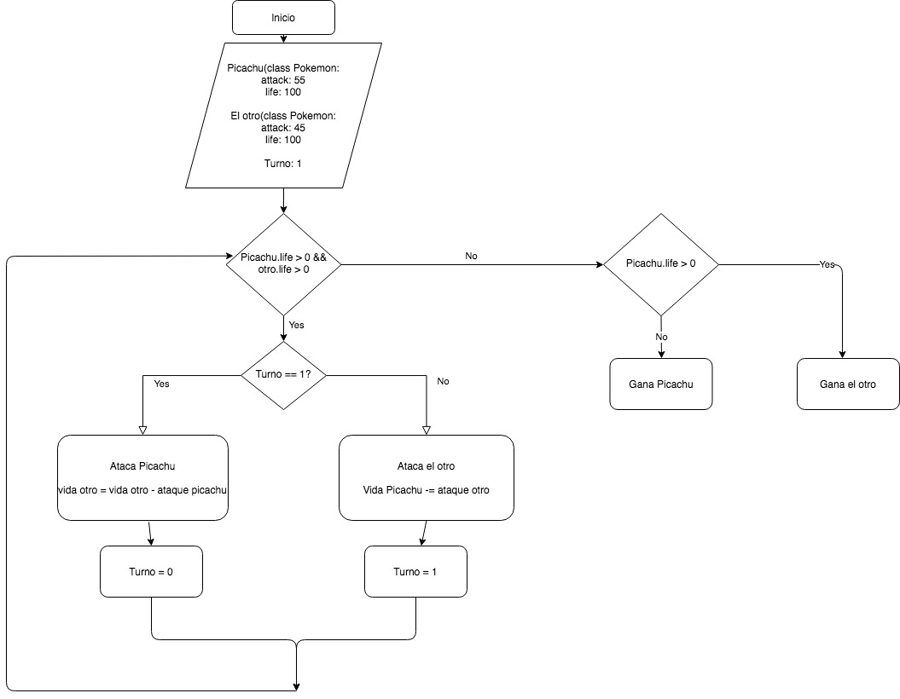

# Tarea 3.3: El Juego de Picachu

## Enunciado

"Entender y dibujar el diagrama de flujo del programa de picachu tal y como se explica en el vídeo que adjuntamos y posteriormente codificarlo mediante un lenguaje de programación, es decir, construir el programa tal cual se indica en el diagrama. 

#### Diagrama de flujos

## Ejecución

Ejecutar comando python3 picachu.py en la terminal.

En esta versión no hay interactividad. Los valores de los ataques están metidos a mano y siempre gana el mismo Pokemon.
